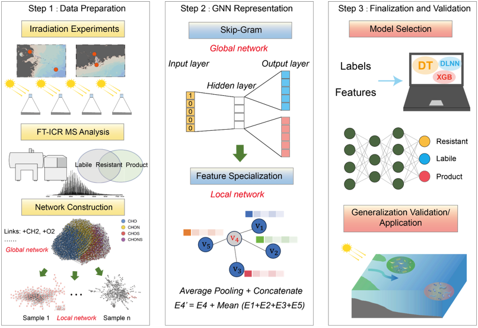

# Graph Learning for Resolving Label Conflicts in Photochemical Experiments

  
*Figure 1: Workflow of the dual-network graph learning approach.*

## 📌 Background
In photochemical experiments, the same molecule may exhibit different behaviors (e.g., **Labile**, **Resistant**, or **Product**) across samples due to varying environmental conditions. This leads to **label conflicts** when training machine learning models. For example:
- *Molecule 1*: Labeled as `Labile` in Sample A but `Product` in Sample B.
- *Molecule 2*: Labeled as `Resistant` in Sample C but `Product` in Sample D.

Traditional single-network approaches fail to capture these contextual differences, resulting in poor generalization.

## 🚀 Solution: Dual-Network Graph Learning
We propose a **global-local graph neural network (GNN)** framework to resolve label conflicts by combining unsupervised global patterns and sample-specific local features.

### Step 1: Data Preparation & Network Construction
- **Irradiation Experiments**: 4 groups (8 samples: A1, A2, B1, B2, C1, C2,D1, D2) with FT-ICR MS analysis.
- **Global Network**: 
  - Unsupervised representation on all samples.
  - Links represent molecular reactions (e.g., `+CH₂`, `+O₂`).
  - Captures universal patterns (e.g., common reaction pathways).
- **Local Networks**: 
  - One sub-network per sample (A1, A2, B1, B2, C1, C2, D1, D2).
  - Incorperating sample-specific features.

### Step 2: GNN Representation
- **Global Embedding** (Skip-Gram):  
  Random walks generate molecule embeddings reflecting shared properties.
- **Local Feature Specialization**:  
  Enhances embeddings with sample context (e.g., `E4' = E4 + Mean(E1+E2+E3+E5)`).
- **Feature Fusion**:  
  `Average Pooling + Concatenate` merges global and local embeddings.

### Step 3: Model Validation
- **Classifiers**: Compared DT, DLNN, and XGB on fused embeddings.
- **Key Improvement**:  
  Local networks resolve conflicts (e.g., distinguishing "Molecule X" in Sample A vs. B).

## 🎯 Results
- **Accuracy Boost**: Local features improved classification F1-score by **X%** (see `Results/Performance_Metrics`).
- **Case Study**:  
  *Molecule 1*: Correctly classified as `Labile` in Sample A and `Product` in Sample B after local feature integration.

## 🛠 Repository Structure
├── Data_Preparation/ # Raw data & network construction
├── GNN_Representation/ # Global-local embedding codes
├── Model_Validation/ # Classifiers & performance tests
├── Results/ # Metrics and visualizations
└── References/ # Related papers

---

**How to Use This Repository**:  
See `Data_Preparation/README.md` for data processing and `GNN_Representation/train.py` for model training.
